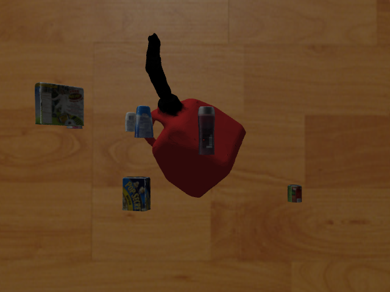

# model_pose_dataset_generation

Synthetic data generation for grasp synthesis.
   Generates images of a target object in various poses (with random clutter), annotated with object pose and keypoints.

Originally created for my [my undergrad thesis project](https://scholarship.tricolib.brynmawr.edu/handle/10066/19290) in 2016.

Objects are rendered in Gazebo.  The dataset is stored in the HDF5 format (see "REFERENCE" for
details).

NOTE: See "todo.txt" for a list of outstanding problems and planned features.  If you see something you'd like to improve, send a pull request my way!

## Setup and usage

### Software Requirements:
1. Python 2.7
2. ROS (only tested on Indigo)
3. Gazebo (only tested w/ Gazebo 8)

### Set up models and data
- **Set up BigBird models:**
  1. Use [these
  scripts](https://github.com/GraspDeepLearning/gazebo_data_gen_gdl/tree/master/src/get_models) to download and format the clutter objects.  
  2. Add models to ~/.gazebo/models/bigbird.
  3. Run scripts/gazebo_media_setup.sh to add model paths to environment.
- **Set up custom target model:**  if you don't want to use the default model (a gastank).
  1. [Create a gazebo model](http://gazebosim.org/tutorials?tut=build_model) for your object, and
     move it to models/.
  2. Create keypoint annotations file, keypoints.pp.  This can easily be done manually, using [Meshlab's](http://www.meshlab.net/) "pick points" tool.
    - keypoints.pp must be in the root dir of your model.
  3. Update the "model_name" param in generate_dataset.launch.
    - Optionally, update "clutter_exclude_region" with the object's bounding rectangle.

### Generate data:
- Edit dataset parameters in launch/generate_datset.launch.
- Roslaunch generate_dataset.launch to set up the Gazebo world.
- Run the 'model_views.py' script.

To extract images from the dataset, run the script "extract_images.py".

## Useful info: 

See **gastank_diagram.pdf** for a labeled diagram of keypoint locations on the object.

HDF5 dataset schema:

    NOTE that image is indexed [row, col], while keypoints given [x,y].

    =DSET NAME:=            =SHAPE=                         =NOTE=

    images                  [?, img_height, img_width, 3]    "?" = number of images.
    keypoints_in_image      [?, ??, 2]                       "??"= num keypoints.  [x, y].
    keypoints_in_world      [?, ??, 3]                       3D pose of keypts, in camera frame.
    model_pose              [?, 7]                           (Quaternion, Point) in camera frame.

